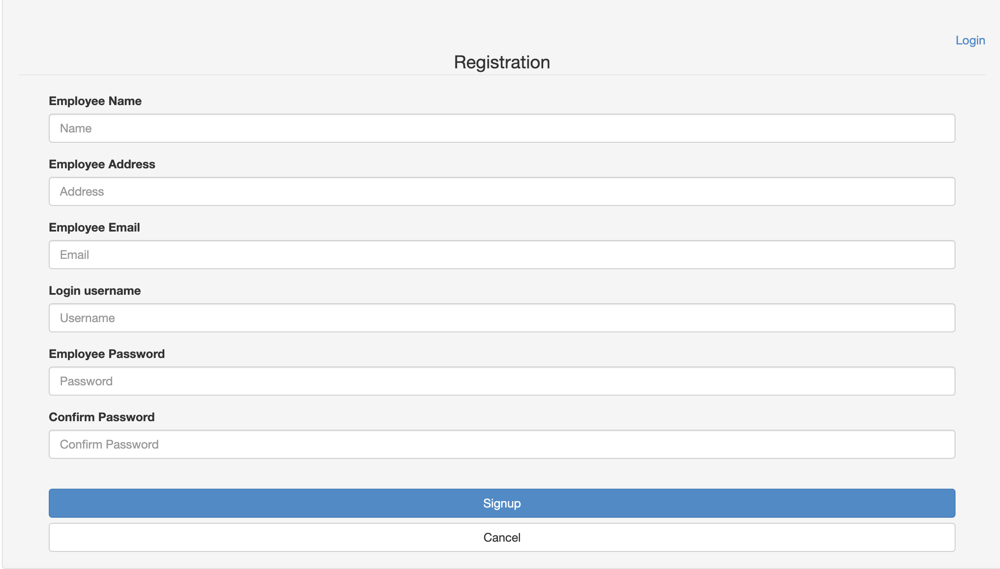

# codeigniter signup form

<h3>Description</h3>
  Simple registration form and login form with following features.

  - Bootstrap forms
  - Form validation
  - Signin and signup forms
  - List all the users forms
<h3>Image</h3>
  

      
  

  

      
  

  

      
  

<h3>Requirment</h3>

  - PHP 7.3.3
  - CodeIgniter-3.1.10
  - Webserver

## How to Use: 
* Clone repo & put them to webserver site
* Run spaceship/db/migrate/2019_04_06_00537 SQL by manually
* Update spaceship/application/config/database.php for mysql database (set $db['default'] )
* Navigate to your site

### Run the project
* local server: http://localhost/spaceship/
